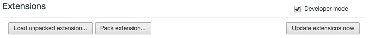

# hudl-keymapper
Dynamic key mapping chrome extension for Hudl basketball post game breakdowns.
Allows both use of a keyboard and a USB Hudl remote.

# Installation
 - Download the entirety of the git repository
 - Go to Chrome settings and enable `Developer Mode` in the upper right-hand corner:
 
 
 
 - Drag and drop the `hudl-keymapper` folder onto the Google Chrome page (or choose `Load unpacked extension` and navigate to the `hudl-keymapper` folder)
 - (OPTIONAL) If you have a remote, navigate to [chrome://flags](chrome://flags) in Google Chrome
    - Find `Experimental Extension APIs`, and click its `Enable` link
    - Restart Google Chrome
    - Drag and drop (or navigate to) the `hudl_remote_app` subfolder within `hudl-keymapper` at [chrome://extensions](chrome://extensions)
 - There should now be an icon in the top bar of the Hudl logo overlayed with a keyboard and two new extensions under [chrome://extensions](chrome://extensions)

# Usage

 - Navigate to a post game breakdown basketball page and watch the magic happen!